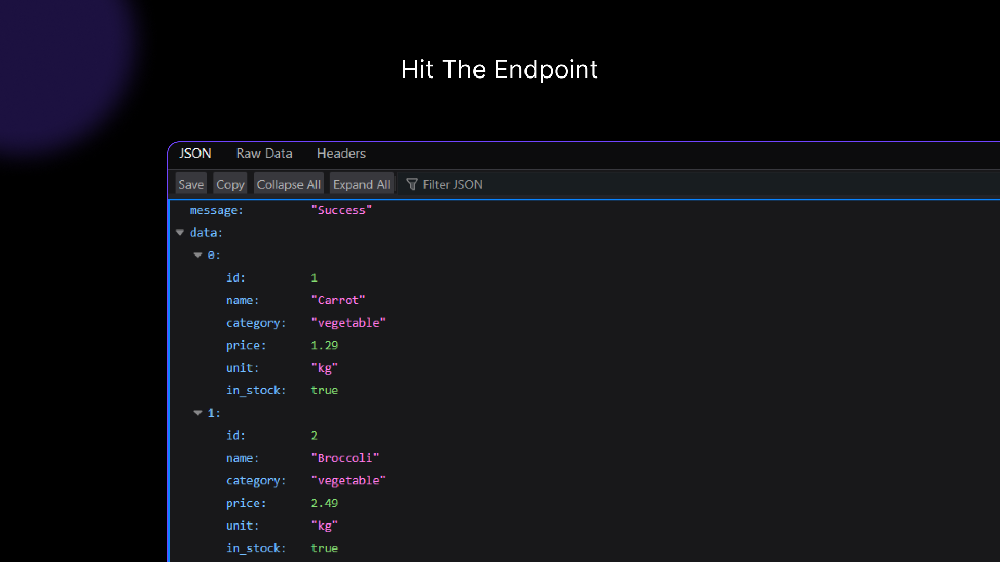

# Mocktopus 🐙

**A Zero Setup and Standalone API Mocking Tool**

<!-- Badges -->

  
  

  
  
  
  
  

 

[**Report Bug**](https://github.com/manjeyy/PseudoServer/issues) • [**Request Feature**](https://github.com/manjeyy/PseudoServer/issues)

---

## 📖 Description

**Mocktopus** is a powerful, standalone API mocking tool designed to streamline your frontend development workflow. With zero setup required, you can instantly spin up a mock server, create endpoints, and manage your API responses with ease.

Whether you are testing edge cases, developing offline, or waiting for backend implementation, Mocktopus provides a seamless experience to keep your development moving forward.

## ✨ Features

*   **🚀 Zero Setup:** Open the app, set a port, and you're ready to go.
*   **⚡ Instant Mocking:** Create new endpoints and paste your JSON responses instantly.
*   **🛠️ JSON Editor:** Built-in editor for managing complex JSON structures.
*   **📂 Project Management:** Organize your mocks into projects for better maintainability.
*   **🎛️ Server Controls:** Start, stop, and restart your mock server with a click.
*   **🛣️ Sub-route Manager:** Handle nested routes and dynamic paths effortlessly.
*   **📑 Tab Manager:** Work on multiple endpoints simultaneously.

## 📸 Screenshots

  
    
  
    
  

## 🚀 Getting Started

1.  **Download** the latest release from the [Releases page](https://github.com/manjeyy/PseudoServer/releases).
2.  **Install** the application.
3.  **Open** Mocktopus.
4.  **Set a Port** (e.g., 3000).
5.  **Create Endpoints** and paste your JSON.
6.  **Start Server** and BOOM! 💥

## 🛠️ Built With

*   [Next.js](https://nextjs.org/)
*   [Electron](https://www.electronjs.org/)
*   [Tailwind CSS](https://tailwindcss.com/)
*   [Shadcn UI](https://ui.shadcn.com/)

## 🤝 Contributing

Contributions are what make the open source community such an amazing place to learn, inspire, and create. Any contributions you make are **greatly appreciated**.

1.  Fork the Project
2.  Create your Feature Branch (`git checkout -b feature/AmazingFeature`)
3.  Commit your Changes (`git commit -m 'Add some AmazingFeature'`)
4.  Push to the Branch (`git push origin feature/AmazingFeature`)
5.  Open a Pull Request

## 📝 License

Distributed under the MIT License. See `LICENSE` for more information.

